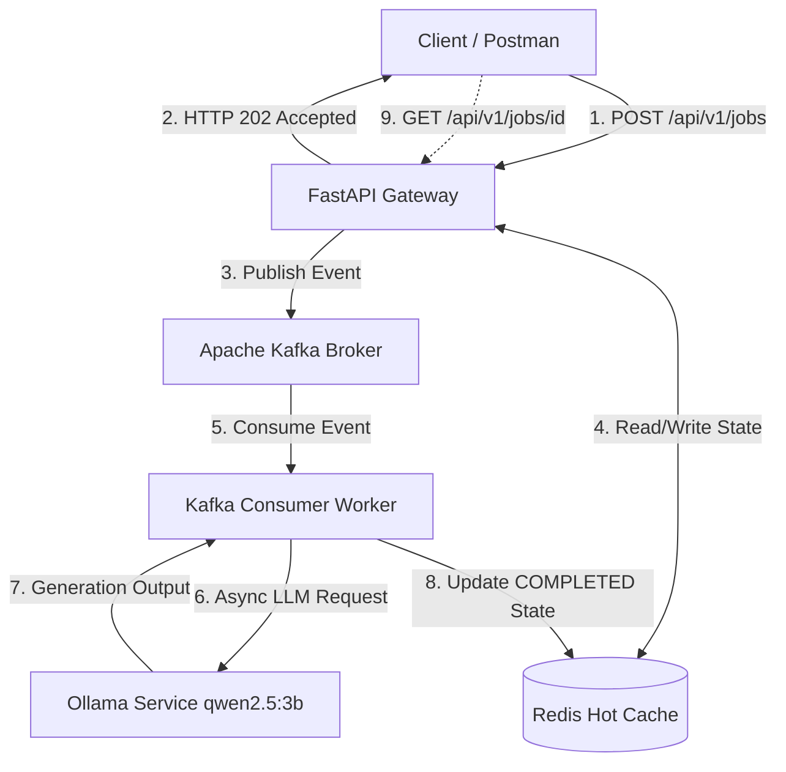

# TraceFlow-AI

An event-driven, distributed API gateway and execution engine for distributed AI workflows, prompt tracing, and async LLM task queue management.

Designed to eliminate LLM processing bottlenecks, handle rate limits gracefully, and provide complete observability over distributed AI execution pipelines.

---

## Architecture Blueprint



---

## Key Capabilities

* **Asynchronous Non-Blocking Gateway:** Returns `HTTP 202 Accepted` immediately upon ingestion, keeping client latency under 30ms regardless of model response time.
* **Event-Driven Architecture:** Decouples API ingestion from background execution using Apache Kafka (`aiokafka`) topics and dedicated consumer groups.
* **High-Performance Caching:** Utilizes Redis (`redis.asyncio`) for hot-state tracking (`PENDING`, `COMPLETED`, `FAILED`) with automatic 24-hour TTL expiration.
* **Fail-Fast Core Engine:** Built with FastAPI and `pydantic-settings` to enforce strict environment configuration without implicit runtime fallbacks.
* **Contract Enforcement:** Pydantic v2 schemas validating inbound request payloads and output metadata.
* **Automated Test Infrastructure:** Fully isolated ASGI unit and integration test suite (`pytest` + `httpx.AsyncClient`) with auto-mocked event streaming and cache layers.

---

## Benchmark Metrics

| Metric | Measurement | Target / Engine |
| --- | --- | --- |
| **Ingestion Latency** | `< 30ms` | FastAPI + Kafka Producer (`202 Accepted`) |
| **Polling Latency** | `< 2ms` | Redis In-Memory Lookup |
| **LLM Execution Engine** | `~15.2s` | Local Ollama (`qwen2.5:3b`) |

---

## Quickstart

### Prerequisites

* Python 3.11+
* Docker Desktop (for Apache Kafka KRaft mode)
* Local Redis Server
* Ollama running locally (`ollama pull qwen2.5:3b`)

### Setup & Infrastructure

```bash
# 1. Configure environment variables
cp .env.example .env

# 2. Start Kafka container (via Docker)
docker compose up -d

# 3. Start Redis server
sudo service redis-server start

# 4. Create virtual environment & install dependencies
python -m venv venv
source venv/bin/activate  # On Linux / WSL
pip install -r requirements.txt

# 5. Start API Gateway (Includes Producer & Background Consumer)
uvicorn app.main:app --reload --port 8000

```

### Running Tests

```bash
# Execute automated test suite with mocked infrastructure
pytest

```

---

## API Endpoints

| Method | Endpoint | Description | Response Status |
| --- | --- | --- | --- |
| `GET` | `/health` | Service health & version assertion | `200 OK` |
| `POST` | `/api/v1/jobs` | Submit LLM job asynchronously via Kafka | `202 Accepted` |
| `GET` | `/api/v1/jobs/{job_id}` | Poll execution status & output from Redis | `200 OK` / `404 Not Found` |
